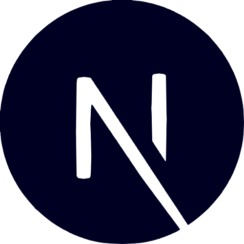

## **Hello, Devs! Me chamo Bruna Campos! ✨**
  
> #### Sou programadora, designer e técnica em desenvolvimento de sistemas

## Sobre mim

💜 Sou curiosa, empenhada em aprender constantemente e adoro desenvolver soluções

💻 Possuo experiência em **HTML, CSS e ReactJS** 

📄 Possuo experiência em **Design Web e Figma**

☕ Adoro um cafézinho

⭐ Gosto de ler, tocar ukulele e desenhar

## **Tecnologias & Ferramentas**

  
  
  
   
    
    
    
     
     
  

    

 ## **GitHub Statistics**

   
  
   

#

Feito com 💜 por Bru
